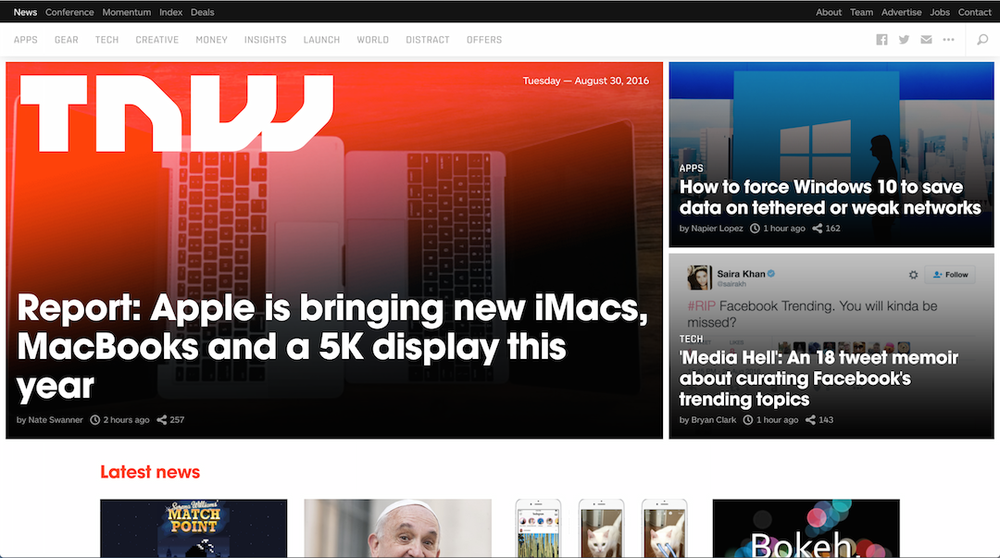
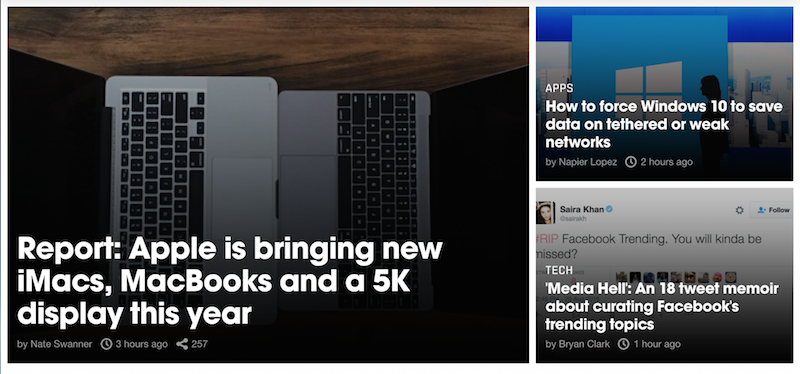
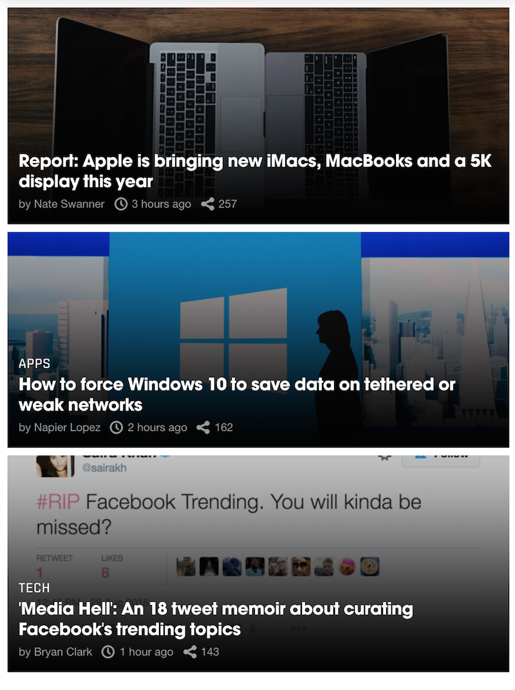
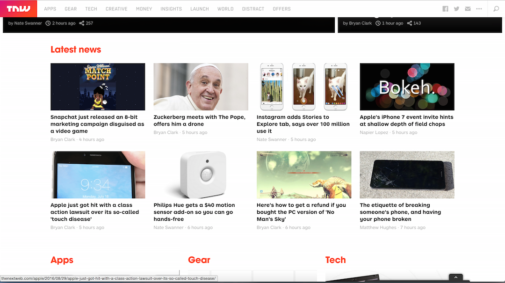
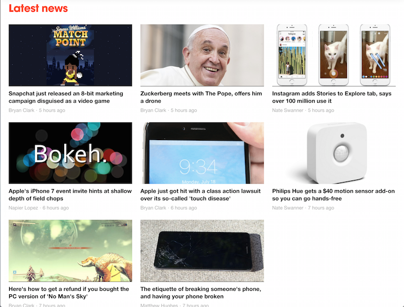
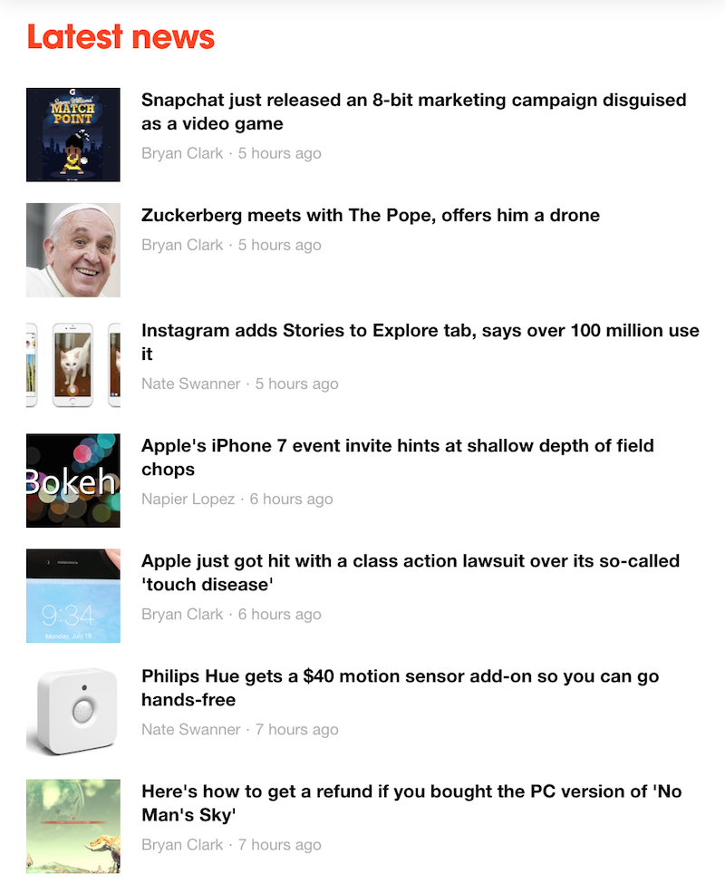
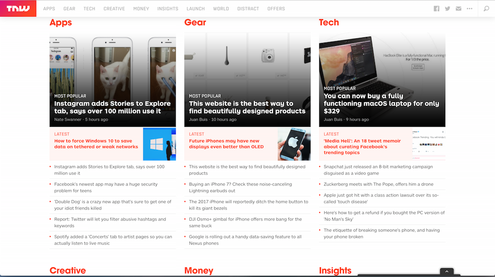
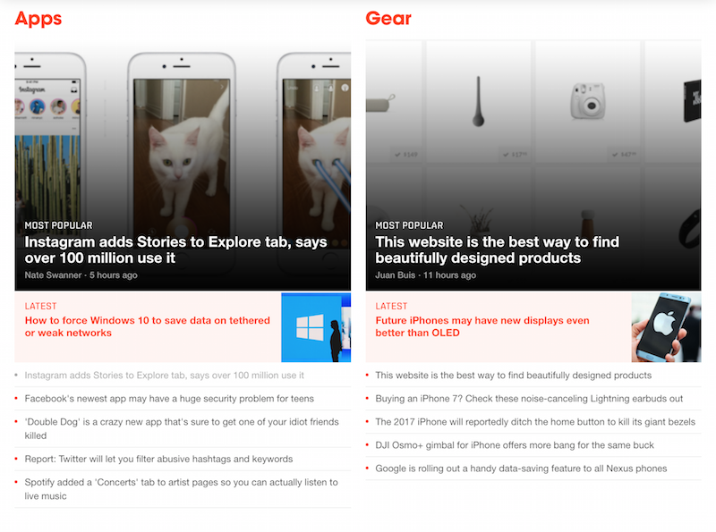
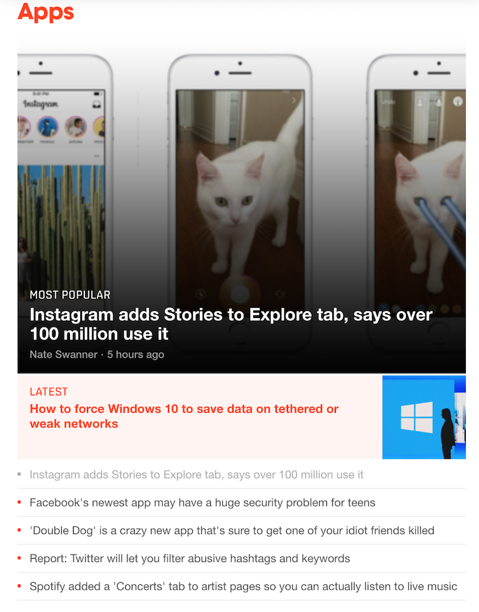

## Bootstrap Site Replication

### Introduction

**Note: Please refer to the screenshots as a requirement at `images/screenshots`**

Previously, we have learn about user interface and how people interact with websites, which is called front-end. We have learnt basic HTML and CSS. HTML defines what elements to be show on the webpage. CSS defined the styling of these elements.

We then introduced a HTML and CSS library, called Bootstrap. It's a library that helps you create a beautiful responsive front-end.

### Getting Started

  Everything is connected. All you need to do is the code!

  1. Fork the project to your account
  1. Clone the project to your computer
  1. Start Coding in `index.html`

### Instructions

  **Keep in mind, you need to code for different size of browser!!!!**

  1. Section 1 & 2 (required)
    - try Section 2 first to get the feel, then try Section 1
    - Use your newly learnt skill "Chrome Developer Tools" to get the images yourself!!!
  1. Section 3 (Bonus | Easy)
  1. Navbar (Bonus | Hard)
    - Attempt the following without animations
      - The "TNW" ICON on the left will popup window is resized
      - The "..." ICON (show/hide) and extra links (hide/show) when window is resized
      - The "menu" ICON (shows/hide) and all links (hide/show) when window is resized
    - **Ignore the "..." to dropdown a menu**
    - **Ignore the "..." to show the list of social media icons**
    - **Ignore the "menu" to show the side bar**
    - **Ignore the "search" to show a search screen**

### Deliverable

